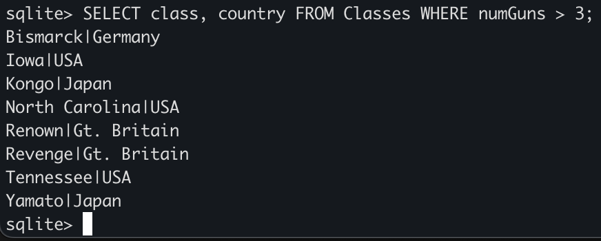
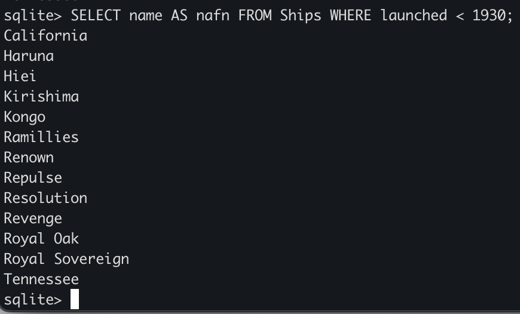
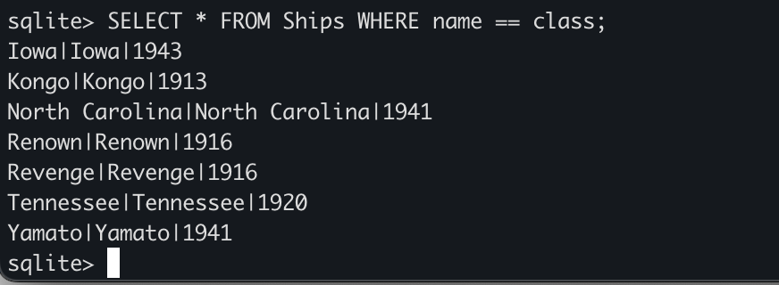
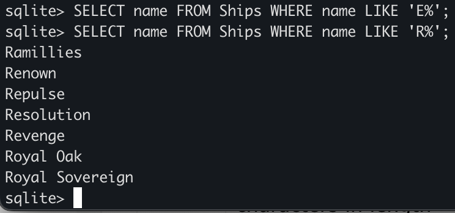
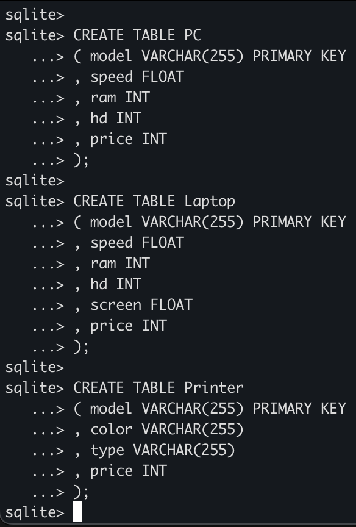

# Gagnasafnsfræði - Verkefni 3
#### Anton Benediktsson - anb59@hi.is
---

1. Leysið eftirfarandi liði miðað við gagnagrunnsskilgreininguna sem gefin er —
Solve the following for the given database definition:
```
Classes(class,type,country,numGuns,bore,displacement)
Ships(name,class,launched)
Battles(name,battledate)
Outcomes(ship,battle,result
```

```
SELECT * FROM Classe WHERE Classes.class == (SELECT class FROM Ships WHERE launched > 1940);
```

 a. Finnið tegund (class) og land (country) fyrir allar tegundir skipa með að minnsta kosti 4 byssur (guns). (Find the class name and country for all classes with at least 4 guns.)



 b. Finnið nöfn allra skipa sem sett voru á flot fyrir 1930, en nefnið dálkinn nafn. (Find the names of all ships launched prior to 1930, but call the resulting column nafn.)

```
SELECT name AS nafn FROM Ships WHERE launched < 1930;
```


 c. Finnið öll skip sem hafa sama nafn og þeirra tegund (class). (Find all ships that have the same name as their class name.)
```
SELECT * FROM Ships WHERE name == class;
```


 d. Finnið nöfn allra skipa sem byrja á stafnum „E“. (Find the names of all ships that begin with the letter “E”.)

```
SELECT name FROM Ships WHERE name CONTAINS 'E%';
```



---

 2. Dæmi 3.1, bls. 33 í bók. Dæmið er eftirfarandi: Skilgreinið eftirfarandi vensl í SQL: 
Exercise 3.1, p. 33 in the book. The exercise is the following: Define the follow-ing relation in SQL:
```
Product(maker, model, type)
PC(model, speed, ram, hd, price)
Laptop(model, speed, ram, hd, screen, price)
Printer(model, color, type, price)
```
Þið megið gera ráð fyrir að model gildið sé einstakt fyrir hverja vöru. Mælið
hraða (speed) í GHz, minnisstærð (RAM) og diskastærð (hd) í Gb, verð (price)
í krónum og skjástærð (screen) í tommum. Þið munið nota CREATE TABLE
skipanir í SQL til að skilgreina venslin. Ef til vill er gagnlegt að hafa vefsíðu1
um CREATE TABLE skipunina í SQLite til hliðsjónar, en athugið að tögunin
í SQLite er frábrugin öðrum afbrigðum SQL. Rétt er að nota tögun sem er í
samræmi við SQL staðal. Notið því þá tögunarmöguleika sem skilgreindir eru á
blaðsíðu 17 í glærum viku 2 (skráin gsf_g2.pdf í Canvas). SQLite mun ekki
kvarta þótt þið setjið eitthvert bull í tögun dálka, en við munum ekki gefa rétt
fyrir slíkt í yfirferð í Gradescope.

* Skilgreinið venslin Product í SQL. Define the relation Product in SQL.
* Skilgreinið venslin PC í SQL. Define the relation PC in SQL.
* Skilgreinið venslin Laptop í SQL. Define the relation Laptop in SQL.
* Skilgreinið venslin Printer í SQL. Define the relation Printer in SQL.

Takið fram ef einhver eigindi ættu að vera lyklar og hafið það sem hluta af ykkar SQL skilgreiningu.

```
CREATE TABLE Product 
( maker VARCHAR(255)
, model VARCHAR(255) PRIMARY KEY
, type VARCHAR(255)
);

CREATE TABLE PC 
( model VARCHAR(255) PRIMARY KEY
, speed FLOAT
, ram INT
, hd INT
, price INT
);

CREATE TABLE Laptop 
( model VARCHAR(255) PRIMARY KEY
, speed FLOAT
, ram INT
, hd INT
, screen FLOAT
, price INT
);

CREATE TABLE Printer 
( model VARCHAR(255) PRIMARY KEY
, color VARCHAR(255)
, type VARCHAR(255)
, price INT
);
```


---

3. Afbrigði af dæmi 2.1, bls. 261 í bókinni. Afbrigðið er eftirfarandi, miðað við
eftirfarandi uppsetningu á gagnagrunni:
A variant of exercise 2.1, p. 261 in the book. The variant is the following, based
on the following database definition:

```
Movie(title,year,length,genre,studioName,producerC)
Starsln(movieTitle,movieYear,starName)
MovieStar(name,address,gender,birthdate)
MovieExec(name,address,cert,netWorth)
Studio(name,address,presC)
```
skrifið eftirfarandi fyrirspurnir í SQL — Write the following queries in SQL:
 
 a. Hvaða kvenkyns stjörnur voru í Titanic? (Who were the female stars in
 Titanic?)

```
SELECT starName, gender FROM StarsIn, MovieStar WHERE starName == name AND movieTitle == "Titanic" AND gender == "F";
```


 b. Hvaða stjörnur komu fram í kvikmyndum sem framleiddar voru af Paramount í 1980? (Which stars appeared in movies produced by Paramount in 1980?)

```
SELECT StarName,movieTitle,studioName,year FROM StarsIn, Movie WHERE studioName == "Paramount" AND year == 1980;
```

 c. Hver er forstjóri Paramount kvikmyndaversins? (Who is the president of Paramount studios?)

 ```
 SELECT Studio.name, MovieExec.name FROM MovieExec,Studio WHERE cert==presC AND Studio.name == "Paramount";
 ```
 
 d. Hvaða kvikmyndir eru lengri en Star Wars? (Which movies are longer than Star Wars?)

```
SELECT title, length FROM Movie WHERE length > (SELECT length FROM Movie WHERE title == "Star Wars")
```
 
 e. Hvaða stjórnendur eiga meira en George Lucas? (Which executives are worth more than George Lucas?)

 ```
 SELECT name, NetWorth FROM MovieExec WHERE netWorth > (SELECT netWorth FROM MovieExec WHERE name == "George Lucas"); 
 ```